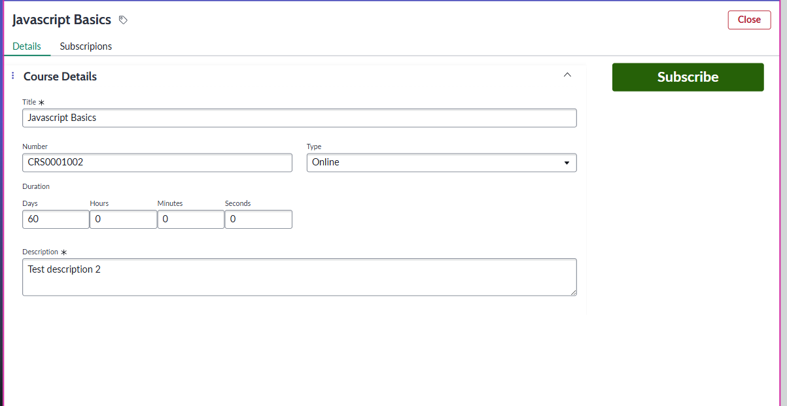
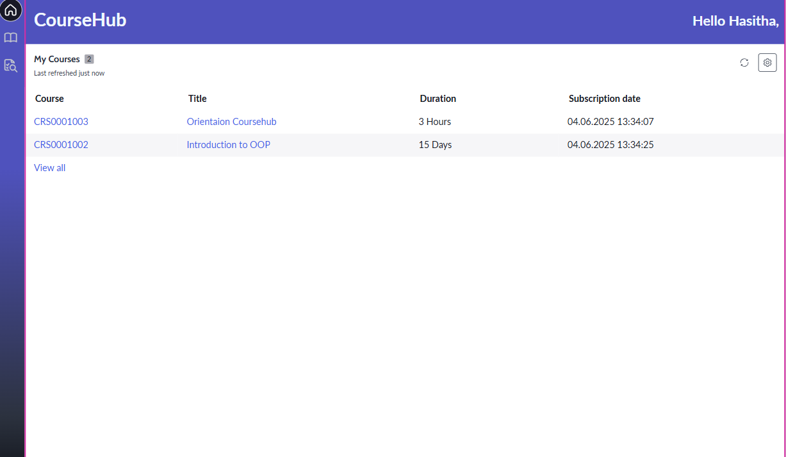

# Course Hub - Solution

Welcome to the **Course Subscription Application**!, A simple ServiceNow prototype that allows **Learners** to view and subscribe to **Courses** using the platform's native capabilities such as tables, UI Builder, Data Resources, and UX Components.

## Application Overview

The application **CourseHub** is built on the **ServiceNow Now Experience Framework** and showcases:
- A Simple Dashboard to view recently added courses and some user-specific insights
- A list of available courses (List View)
- A detailed view of selected course (Form View)
- The ability for users (learners) to subscribe or unsubscribe

#### - UI tailored using Service Now **UI Builder**
#### - UI functionality tests using **Robot Framework** 

### Data Tables

The application consists of 4 main tables:

1. **Course** (`x_quo_coursehub_course`)
2. **Learner** (`x_quo_coursehub_learner`)
3. **Course Subscription** (`x_quo_coursehub_course_subscription`)
4. **Course Feedback** (`x_quo_coursehub_course_feedback`)

All the tables come with default fields: `sys_id`, `created`, `created_by`, `updated`, `updated_by`.

## 🧩 Key Features

### 📊 Simple Dashboard

- Display the count of active courses
- Display the Count of Own Subscriptions
- Display recently added courses (Sorted by CreatedDate Desc)

📷 

### 📚 Course Listing

- A **List View** displaying all available courses using **x_quo_coursehub_course** table.
- Fields shown: **Number**, **Title**, **Description**, **Duration**.
- **Subscribe** button is visible when a Course is selected. The button is **Hidden** when logged-in user is already subscribed to the Course.

📷 

---

### ✅ Course Subscription Logic

  #### 1. Traditional Subscribe Button
  📷 
  - Only visible if the logged-in user is not subscribed to a course.
  - Clicking "Subscribe" button proceeds a scenario that creates a record in the **Course Subscription** table.
  - A popup model opens after hitting Subscribe button to confirm your action. 📷 
  
    
  #### 2.  **Unsubscribe** button 
  📷 
  - Only visible if the logged-in user is already subscribed to the selected Course.
  - Clicking "Unsubscribe" button proceeds a scenario that deletes a record from the **Course Subscription** table.
  - A popup model opens after hitting Unsubscribe button to confirm your action. 📷 

  #### 3. A feedback can be provided when unsubscribing a Course
  📷 
  - A popup model opens after confirming Unsubscribe through Unsubscribe Confirmation model.
  - A StarRating input and Text area is visible inside a custom model to insert a new feedback record to  **Course Feedback** table
  - Posting feedback can be skipped from the Skip button available in the model popup. 

### 🔒 Duplicate preventions
  - Subscribe button is visible only by checking the **Course Subscription** table for selected course and session-user.
  - Record creation action will validate the **Course Subscription** table beforehand creating a new record whether it already exists through a Client Script.
  - This Prevents duplicate subscriptions.

---

### 👤 My Subscriptions
- Shows the learner's own subscriptions
- Data is filtered using a **Lookup Multiple Records** data source
- Conditional visibility is used to match course `sys_id` to subscription records

📷 

---

## 🧪 Testing

Tests are written in **Robot Framework** and located in the `/Tests` folder.

### Support

📝 Setup Instructions

- Clone the repo via ServiceNow Studio or Source Control
- Install on your instance (Scoped App)
- Navigate to UI Builder and open the Course Subscription page
- Preview and test via Workspace

🙋‍♂️ Contributors
   - Hasitha Nawalage – https://www.linkedin.com/in/hasitha-chandana/
   - Contact: hasithacnawal@gmail.com

